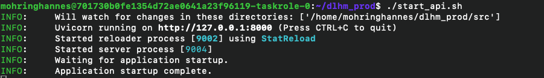
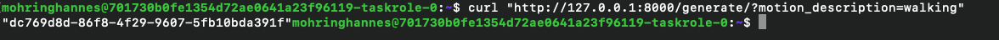
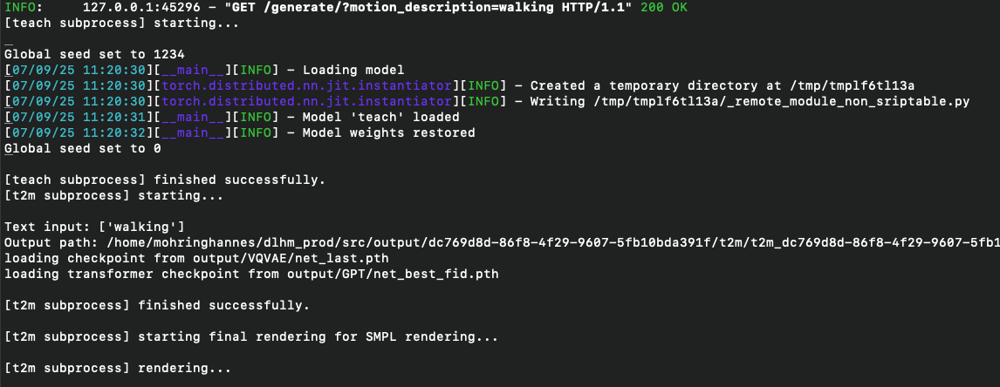
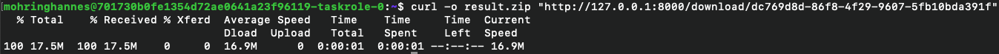

# Motion Generation from Textual Descriptions

This project enables **motion generation** from textual descriptions using two models: **T2M** and **TEACH**.  
Given a text input, the system generates a corresponding 3D motion and provides a downloadable archive with the results.

## For CAMP PAI users

In the directory `camp_configs`, there are scripts available for more advanced but automated usage of the models as well as the scripts used for training them. This only works as long as the required files exist in `projects/dlhm/mohringhannes`.

In order to integrate custom SMPL models here, replace that models existing in `dlhm_prod/models/t2m/T2M-GPT/smpl_body` and `teach/data/smpl_models/smpl`.

---

## 📂 Project Structure

```
.
|-- models
|   |-- t2m
|   `-- teach
|-- scripts
`-- src
    |-- model
    |-- model_store
    `-- output
        |-- <request_id>
            |-- t2m
            `-- teach
```

- `models/` – Pretrained environments and model dependencies
- `scripts/` – Utility scripts
- `src/model/` – Core model code
- `src/model_store/` – Model management
- `src/output/` – Generated motions, organized by request IDs

---

## ⚙️ Setup

1. **Download & Unpack**  
   First, download and unpack the provided project folder. When unpacked, the project might be out of date and `git pull` has to be called.

2. **Install Requirements**

   ```bash
   python -m pip install -r requirements.txt
   sudo apt install uvicorn
   ```

3. **Model Environments**  
   Each model requires its own environment:

   - **T2M** → `/models/t2m/unpacked_conda`
   - **TEACH** → `/models/teach/teach_venv`

   Both must use:

   - Python **3.9**
   - Pip **21.3**

   ⚠️ Dependencies for these projects are fragile. It is **highly recommended** to use the **provided environments** instead of recreating them manually. Simply place the provided environment folders at the paths above.

---

## 🚀 Running the API

Start the server with:

```bash
./start_api.sh
```

The API will be available at:

```
http://127.0.0.1:8000
```

## 

## 🖥️ Usage

### 1. Generate a Motion

Send a description to the API:

```bash
curl "http://127.0.0.1:8000/generate/?motion_description=<DESCRIPTION>"
```

➡️ Returns a `request_id`.



### Process started on the server



---

### 2. Check Status

Query the status of your generation:

```bash
curl "http://127.0.0.1:8000/status/<request_id>"
```

---

### 3. Download the Motion

Once completed, download the ZIP folder with the rendered motions:

```bash
curl "http://127.0.0.1:8000/download/<request_id>" --output result.zip
```

This archive will contain both **T2M** and **TEACH** outputs under the corresponding request ID.



---

## 📊 Output

Each run creates a folder under `src/output/<request_id>/` with the following structure:

```
src/output/<request_id>/
|-- t2m
`-- teach
```

---

## ⚠️ Notes

- Ensure you have **Python 3.9** and **pip 21.3** for the environments.
- Provided environments are recommended due to fragile dependencies.
- Server defaults to **port 8000**.

---

## Caveats

- Model Upload is supported for SMPL Models via the model_upload endpoint
  - `curl -X POST "http://localhost:8000/upload_model/" \
-F "model=@SMPL_NEUTRAL.pkl"
`
  - But due to the complex structure of TEACH and other projects, this is fragile.
- Unfortunately, there was no reliable way found to quantitavely measure the quality of single outputs.

---

## Expansion

If there is a need to add other models, a handling method has to be created in model_handler, which can be copied from the other handlers for the most part. The new model also needs defined interpreters and a directory in model_handler. This makes it relatively easy to just add other models later on.

---

## 📜 License

This project utilizes other projects, please repect the applying licenses.
